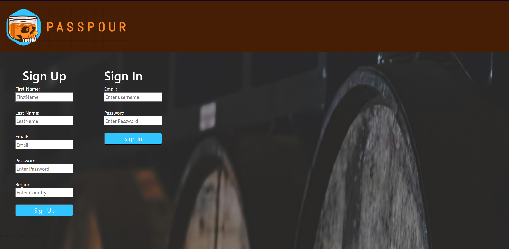
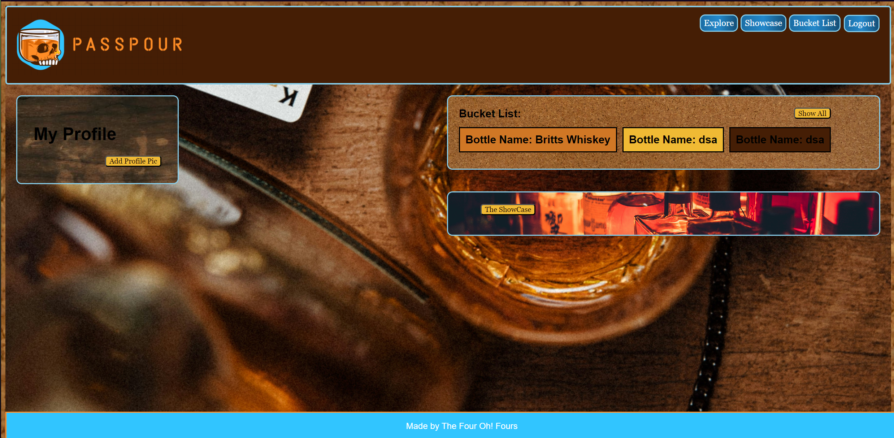
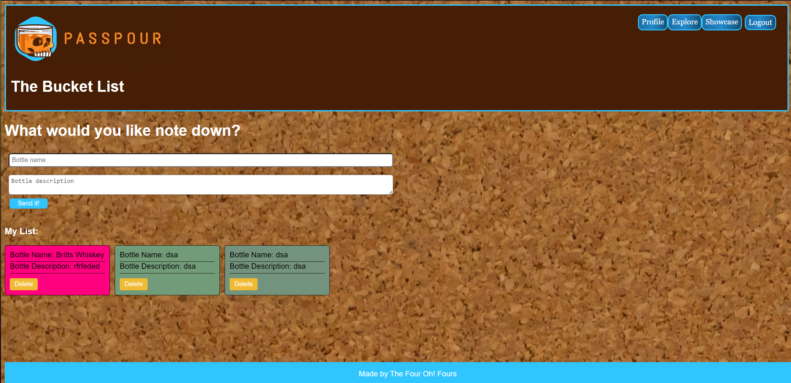
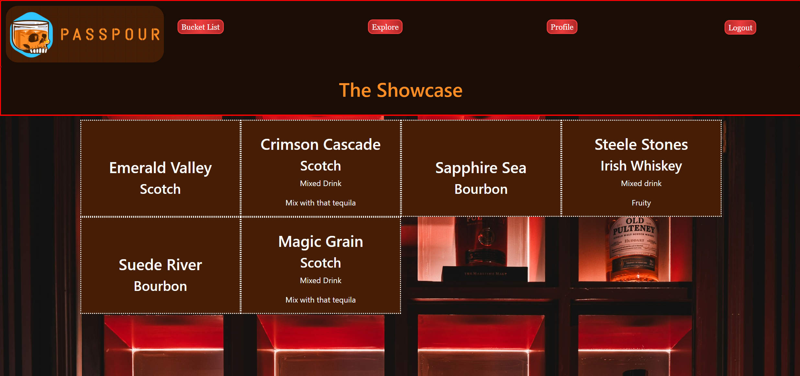

# Group Project: PassPour

## Overview Description:
Your PassPour Awaits! 
Sip, Track, Explore: PassPour Your Whiskey Journey!

Welcome to PassPour: your personal assistant for tracking your Whiskey Collection and capturing your thoughts on each bottle. We've designed this web application to offer you a simple and intuitive way to manage the myriad complexities that crafters worldwide imbue into every bottle.

PassPour serves as your centralized hub for cataloging your collection, allowing you to document your unique experiences with each bottle in detail. Whether it's a rare find or a cherished favorite, your personal entries are tailored to reflect your individual journey.

Connect with fellow enthusiasts to share recipes and opinions, delving into what defines the pinnacle of whiskey excellence.

Accessible from anywhere with an internet connection and an account, PassPour becomes your go-to Bucket List for cataloging every lead, from casual conversations with locals to articles in esteemed publications like Whiskey Advocate Magazine. Every discovery, every hint of a remarkable taste, finds its place within PassPour, guiding you on a quest for the most exquisite flavors.

We invite you to explore our prototype below and welcome any feedback you may have!

## User Stories:
- As a Collector, I want to be able to record and document my collection accessable from anywhere.
- As a Food Critique, I want to be able to review and record even the most delicate notes that Whiskey has to offer.
- As an Event Organizer, I want to be able to select the best type of whiskey for the guests as well as display all of the Whiskey we can provide.
- As a Connoisseur I want to have a bucket list of all of the bottles I want to try.
- As an Entrepreneur, I like showing off to my friends of a new bottle I have aquired.

## Group Project - Acceptance Criteria:

 - As a group, you will decide on an MVP (Minimal Viable Product) Instructor Approval is Optional. 

 - Use a Kanban Board to Track what Tasks everyone is working on.
    - GitHub Projects (Kanban Board): [Click here: PassPour](https://github.com/users/Kylebutcher/projects/1/views/1)

- The application uses semantically correct HTML and has at least 1 page generated from the server via Handlebars.

- The application uses Bootstrap or another CSS Library, along with custom CSS.
  - The site must have a responisve design.

- The applicaiton needs to use Vanilla JaveScript or JQuery for client-side code.

- The application must use NPM: Express with a MVC file structure.

- The applicaiton must use Postgres & Sequelize. 

- The application must have a minimum of 3 data tables and Users should be able to perform a GET and POST function on the models. 

- The User Table should include a field for a hashed password.

- The application should have 1 or more pages that are restricted only to logged-in users.

- The application should have a signup & login form.

- The application must use 1 new technology, library, ect. It can be any of the following:
  - Third-Party JavaScript Library
  - Node Package
  - External API

- All code presented must be clean and well organized.

- There must not be any obvious bugs or errors in the Dev Console.

- All group members must have frequent commits to the project. 

- The README must be well organized:
   - Project description
   - Team Member List
   - Screen Shots &/or Gifs of the Deployed Pages
   - Link to deployed version on Render

## The Mock Up:

Below is a mock up of our application.

The Login Page.

The Home / Explore Page.

The Profile Page.

The Bucket List Page.

The Showcase Page.

The Company Logo.

The Presentation.
[Click Here](https://docs.google.com/presentation/d/1PZod7cFC514Nm8cUHe_S90AkSyS826IWOuSfVPcc48s/edit?usp=sharing) 

## Our Company: The Four Oh! Fours
- Kyle Butcher
- Daisy Osebe
- Joel Simmonson
- Brittany Jungclaus

## Acknowledgements & Technology Stacks
- CSS
   - Custom CSS
   - Bootstrap

 

- JavaScript
   - Vanilla JS
   - JQuery
   - Web Socket .io (Beta)

 

- APIs
   - Mockaroo

 

- Node Packages
   - bcrypt
   - express
   - sequelize
   - socket.io
   - postgres
   - exphbs
   - express-handlebars
   - express-session
   - js-cookies
   - dot.env
   - pg

 

- Misc Software:
   - Windows Mark Up
   - Excalidraw.com
   - Colors.co
   - Unsplash.com 

 

- Presentation Material
   - Template: Slidesgo
   - Icons: Flaticon
   - Infografics & Images: Freepik

## Deployed Application:
[Click Here](https://github.com/Kylebutcher/passpour) to view the Repository for this project.

[Click Here](link-to-deployed-page) to view the deployed version of the web application. 

